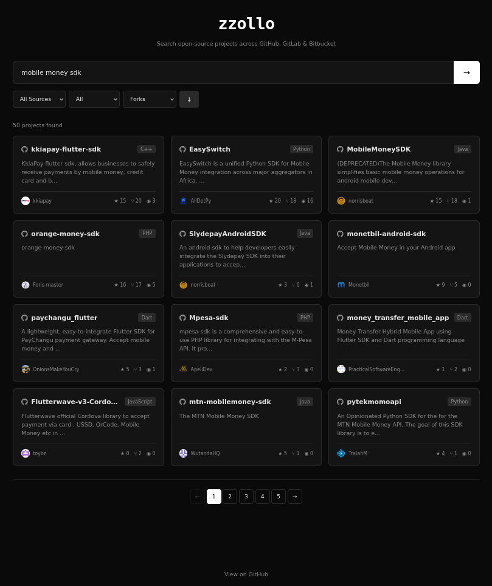

# Polyrepo

A simple React search engine for open-source projects across GitHub, GitLab, and Bitbucket.

[Live demo](https://polyrepo.sanixdk.xyz/) · [Repo](https://github.com/Sanix-Darker/polyrepo)



## Features

- 🔎 **Multi-source search** — query GitHub, GitLab, and Bitbucket at once, or pick a single source.
- 🧭 **Filters** — narrow by source and language; sort by stars, forks, or open issues.
- ⚡ **Smart fetching** — `AbortController` cancels stale searches; source-driven pagination; rate-limit detection with a friendly banner.
- 🎨 **Dark, responsive UI** — plain CSS with CSS variables; no UI framework.

## Stack

- React 18 + `react-scripts` 5 (Create React App)
- Plain CSS
- Browser-native `fetch` against public REST APIs — no backend

## Requirements

- Node.js 18+ (tested on 20)
- Yarn (or npm)
- Docker (optional, for the containerized build)

## Clone

```bash
git clone https://github.com/Sanix-Darker/polyrepo.git && cd polyrepo
```

## Run locally

```bash
yarn install
yarn start
```

App opens at [http://localhost:3000](http://localhost:3000).

### Production build

```bash
yarn build
```

Output lands in `build/`. Serve it with any static server, or use the bundled helper:

```bash
./polyrepo.sh    # installs serve globally, then builds and serves on port 3000
```

## Docker

```bash
docker build -t polyrepo:latest -f ./Dockerfile .
docker run -p 3000:80 -it polyrepo:latest
```

Or with the Makefile:

```bash
make docker-build
make docker-run
```

The container runs as the bundled `nginx` user (uid 101, non-root) on `nginx:1.27-alpine`.

## Tests

```bash
yarn test
```

25 tests across `App`, `Pagination`, and `Item` — smoke + behavior + windowing logic. CI runs on every push and PR via `.github/workflows/ci.yml`.

## Project layout

```
src/
  App.js                          # top-level state, search input, filter selects
  components/
    Item/                         # repository card
    ItemList/                     # fetch + filter + paginate + render
    Pagination/                   # numeric pagination with ellipsis windowing
  index.js                        # React root
```

## Contributing

Pull requests are welcome. Please:

1. Open an issue describing the change (optional but recommended).
2. Fork the project and create a feature branch off `main`.
3. Keep `yarn test` and `yarn build` green.
4. Open a PR — CI must pass before merge.

## Author

- [Sanix-darker](https://github.com/Sanix-Darker)
